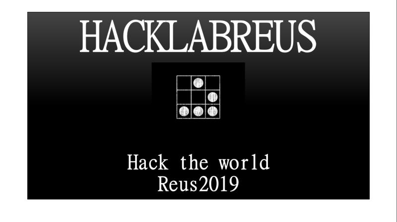

Dissabte passat vam tenir una jornada prou intensa, un servidor va mostrar com mitjatçant un plugin de wordpress podiem comprometre un servidor i garantir l accés i infectar al clients que el visitesin.

De la mà d'Oscar que ens va mostrar la possibilitat de separar les eines de hacking mitjançant docker i interactuar entre elles automatitzant el procès.

Luis Benitez, ens va mostrar moltissims gadgets un d'ells el usbkiller per cremar un equip nomès insertant un Usb i d altres.

I finalment i no menys important en Jordi vidal ens va explicar els procesos per al compliment de l'Esquema Nacional de Seguretat en. l'ambit de les entitats publiques.

Moltes gracies a tots per participar i fins la propera.
Esteu alerta.

{width="400" alt="Hacklabreus-2019" class="centrat"}

A continuació, un resum amb algunes fotos de l’esdeveniment:

