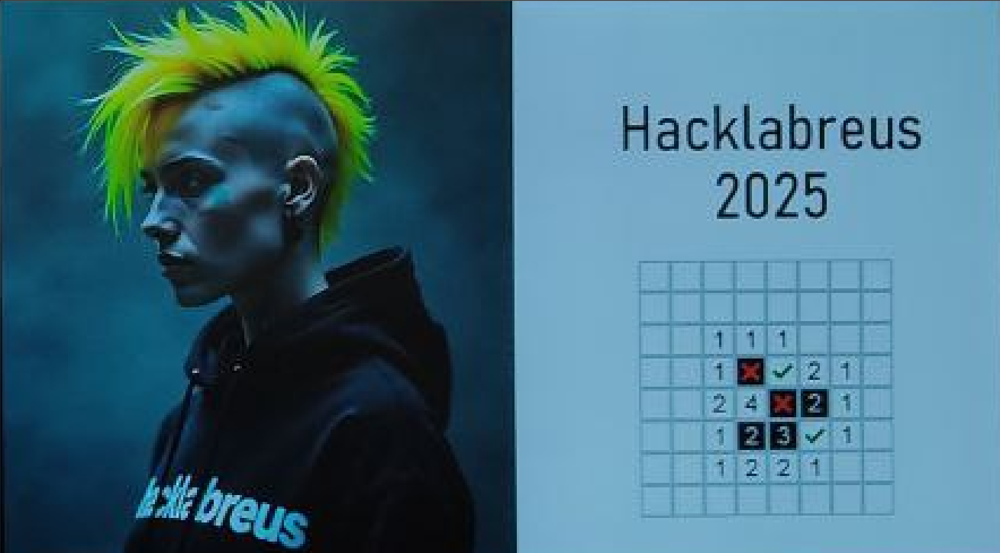

{} 

{}

{width="200" alt="Level4" class="dreta"}
Aquesta edició de 2025 ha estat un èxit. Vam parlar sobre ciberseguretat i bones pràctiques. Gràcies a tots els que hi van assistir!

Des de l’organització de HackLabReus us volem agraïr de tot cor la vostre presència i participació a la jornada d’avui. HackLabReus no seria res sense vosaltres!! L’edició d’aquest any ha superat totes les espectatives i ens anima a continuar.  Un agraïment especial a tots i totes les ponents i al Josep Verge i a la Diputació de Tarragona per cedir-nos un espai inmillorable. També a tots els assistents, una bona part dels quals heu hagut de fer molts kilometres per poder venir. Gràcies i fins la propera HackLabReus!!

A continuació, un resum amb algunes fotos de l’esdeveniment:



