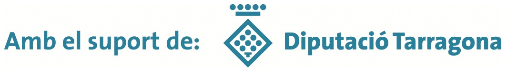

{width="300" alt="hacklabreus2026" class="centre"}

El proper 18 d 'abril a les 09:00 al Centre d 'Innovació i Formació Boca de la Mina de la Diputació a Reus https://maps.app.goo.gl/3UdSsFV2B3SMEQhX6, es durà a terme l'edició 2026 de hacklabreus. L'event està obert i és gratuït. Encara queden unes quantes places per cobrir. Els interessats escriviu un mail a saurushack@protonmail.com i us confirmarem l'acceptació de la plaça. Us hi esperem.

{width="500" alt="diputacio_tarragona" class="centrat sin-borde"}

{}

{width="500" alt="diputacio_tarragona" class="centrat sin-borde"}
{}


Repte:


{}
description: "Obrim la nova edició del hacklabreus2026, resol el repte i t enviarem lloc i data ,passa un dia en comunitat ensenyant i aprenent de tots. T hi esperem properament a Reus"
{}

Des de l’organització de HackLabReus us volem agraïr de tot cor la vostre presència i participació a la jornada d’avui. HackLabReus no seria res sense vosaltres!! L’edició d’aquest any ha superat totes les espectatives i ens anima a continuar.  Un agraïment especial a tots i totes les ponents i al Josep Verge i a la Diputació de Tarragona per cedir-nos un espai inmillorable. També a tots els assistents, una bona part dels quals heu hagut de fer molts kilometres per poder venir. Gràcies i fins la propera HackLabReus!!

A continuació, un resum amb algunes fotos de l’esdeveniment:

